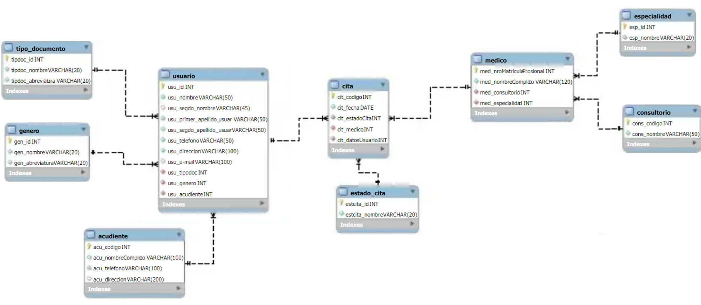

# 🏥 Microservicio CL EPS 

## 📋 Descripción 
CampusLands EPS requiere la creación de un sistema de gestión de citas que permita crear, administrar, consultar y eliminar citas, incluyendo registros y logs. Este sistema backend proporcionará los EndPoints necesarios para que el equipo de Front-End desarrolle la interfaz de usuario para el personal administrativo y los pacientes.

## 🛠️ Requerimientos Técnicos 
Para el desarrollo del sistema Backend, debes tener en cuenta los siguientes puntos:
- Utiliza las tecnologías MongoDB, NodeJS y ExpressJS.
- La conexión a la base de datos se realizará a través del SRV proporcionado por MongoDB Atlas, y se guardarán las credenciales en variables de entorno (dotenv).
- El esquema de la base de datos debe contener un mínimo de 10 documentos, excluyendo las colecciones de género, estado de cita y tipo de documento.
- El sistema Backend debe estar alojado en un repositorio público de GitHub, con un Readme.md que documente su propósito y los EndPoints creados. El desarrollo queda a criterio del desarrollador.
- La colección "estado_cita" puede contener 5 tipos de estados: Programada, Confirmada, En Curso, Atendida y Cancelada.

## 🗃️ Base de Datos NoSQL 

## 🕵️ Consultas

El proyecto proporciona las siguientes consultas para interactuar con los datos:

| Consulta | Descripción |
|---|---|
| `GET /eps/ejs1` | 🧑‍⚕️ **Obtener todos los pacientes en orden alfabético.** |
| `GET /eps/ejs2` | 🗓️ **Obtener citas de una fecha específica ordenadas alfabéticamente por paciente.** |
| `GET /eps/ejs3` | 👨‍⚕️ **Obtener todos los médicos de una especialidad específica.** |
| `GET /eps/ejs4` | 🚫 **No Found.** |
| `GET /eps/ejs5` | 📅 **Obtener todos los pacientes con citas con un médico específico.** |
| `GET /eps/ejs6` | 📆 **Obtener todas las citas de un día específico.** |
| `GET /eps/ejs7` | 🏥 **Obtener todos los médicos con sus consultorios correspondientes.** |
| `GET /eps/ejs8` | 🔢 **Obtener el conteo de citas de un médico.** |
